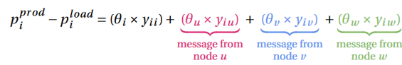
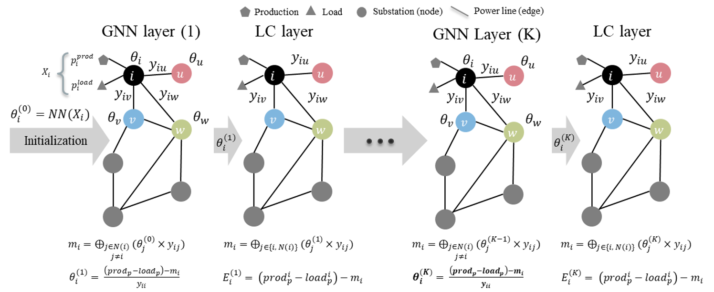

# GNN Powergrid

## Short description of the algorithm
This repository implements Graph Neural Networks for Power Flow (PF) simulation. This implementation will guide future works considering the control (RL based) problem in which the agent's policy could be enhanced using physics informed neural networks.

In this implementation the inputs to the GNN are the injections ($p^{load}$, $p^{prod}$) at nodes and admittances at the power lines ($y_{ij}$) connecting a pair of nodes. Based on these inputs, the GNN outputs the voltage angle $\theta$ at the nodes (substations). Based on these predictions, other grid variables like active power could be computed easily as a post-processing step.  

<div align="center">
  
</div>

<div align="center">
  
</div>

<!-- 
 -->

## Overview of code structure
:open_file_folder: **graph-neural-solver**

├── :open_file_folder: configs

│   └── ...

├── :open_file_folder: getting_started

│   &ensp;&ensp;&ensp;&ensp;└── 0_generate_data.ipynb

│   &ensp;&ensp;&ensp;&ensp;└── 1_example_gnn_without_nn.ipynb

│   &ensp;&ensp;&ensp;&ensp;└── 2_gnn_powergrid.ipynb

├── :open_file_folder: gnn_powergrid

│   └── :open_file_folder: dataset

│     &ensp;&ensp;&ensp;&ensp;└── ...

│   └── :open_file_folder: evaluation

│     &ensp;&ensp;&ensp;&ensp;└── ...

│   └── :open_file_folder: gnn

│     &ensp;&ensp;&ensp;&ensp;└── ...

├── setup.py


The folder *configs* includes all the required configurations for data generation and hyperparameters for constructing GNN based solvers, the folder *getting_started* contains a set of jupyter notebooks guiding the user to how generate, train and evaluate the GNN based implementations, the folder *gnn_powergrid* is the python package including different modules which are `dataset`, `evaluation` and `gnn`. The `setup.py` allows the installation of the package using the required dependencies.

## Installation guide
To be able to run the experiments in this repository, the following steps show how to install this package and its dependencies from source.

### Requirements
- Python >= 3.6

### Setup a Virtualenv (optional)
#### Create a Conda env (recommended)
```commandline
conda create -n venv_gnn python=3.10
conda activate venv_gnn
```
#### Create a virtual environment

```commandline
cd my-project-folder
pip3 install -U virtualenv
python3 -m virtualenv venv_gnn
```
#### Enter virtual environment
```commandline
source venv_gnn/bin/activate
```

### Install from source
```commandline
git clone https://gitlab.inesctec.pt/cpes/european-projects/ai4realnet/irt-systemx/task-1.2/graph-neural-solver.git
cd graph-neural-solver
pip3 install -U .[recommended]
cd ..
```

### To contribute
```commandline
pip3 install -e .[recommended]
```

## Reproducibility
The results presented in the slides could be reproduced by executing `main_wo_nn.py` and `main.py` script.
- `main_wo_nn.py` is the script that used the local conservation law as the optimization criteria and do not use any Neural Network for learning
- `main.py` is the script that add a Dense neural network for the estimation of intitial voltage angles, which should help the faster convergence of the optimization criteria (local conservation law). <p style="color:red">Under improvement</p>

### Input
The set of inputs for the generation of datasets could be found in *configs* folder. There are two configuration files for two different power grid environments presenting each a different grid size. `l2rpn_case14_sandbox` is the toy example with a grid including 14 nodes and 20 power lines. `l2rpn_neurips_2020_track1_small` includes a more complex environment with 38 nodes. The user could use one of the sections in these configuration files when generating and importing datasets. 

Once the environment is selected, you should change the number of samples per dataset before the `main` function which are set only for illustration purpose as: 

```python
NB_SAMPLE_TRAIN = 1e2
NB_SAMPLE_VAL = 1e2
NB_SAMPLE_TEST = 1e2
NB_SAMPLE_OOD = 1e2
```

You could also change the set of hyperparameters of the GNN by modifying the `gnn.ini` configuration file in *configs* folder or by setting them directly as the arguments to the `GnnSimulator` class instantiation. 

```config
env_name="l2rpn_case14_sandbox"
name = "torch_gnn"
ref_node = 0
num_gnn_layers = 10
latent_dimension = 20
hidden_layers = 3
input_dim=2
output_dim=1
train_batch_size = 128
eval_batch_size = 128
device="cpu"
optimizer = {"name": "adam",
             "params": {"lr": 3e-4}}
epochs = 10
train_with_discount=False
save_freq = False
ckpt_freq = 50
```

### Output
As the output of the script `main_wo_nn.py` or `main.py`, two files are created:
- *logs.log* file which includes all the logs of the LIPS framework alongside the outputs
- *results.json* a json file including the metrics computed on the prediction of GNN.
